## IDO

As the diagram above shows, the IDO has a few phases

* Deployed
* Initialized (private presale started)
* Private presale disabled (public presale started)
* Sale closed (funds withdrawn)
* Sale finalized (SCR deposited and claims enabled)

### Initialized

Users in the private sale can purchase `max(1, (amountRemaining/numberPrivateSaleUsers))`.

This means that if a user purchases less than `(amountRemaining/numberPrivateSaleUsers)` the amount available to each remaining private sale user increases.

### Private sale disabled

Users in the public sale are allowed to purchase `min(amountRemaining, publicSaleAmount)` which means if `amountRemaining == 0` there won't be anything available for the public sale.

### Sale closed

When the `closeSale` function is called, the funds deposited by users are sent to the caller. The caller is restricted to a single address, which is ideally another contract rather than an EOA, known as the `finalizer`.

The `finalizer` then mints SCR by depositing the funds into the SecureDAO treasury and then sends the SCR to the presale contract before calling `finalize`.

### Sale finalized

Once `finalize` has been called, users are free to call the `claim` function which will claim and automatically stake their SCR.

### Cancellation

If for some reason, something is wrong with the IDO it can be cancelled at any time. This prevents any additional purchases and allows users to withdraw the funds they deposited.

Cancel doesn't prevent claims so if it is called after the sale is closed, but before it is finalized there is no impact.

